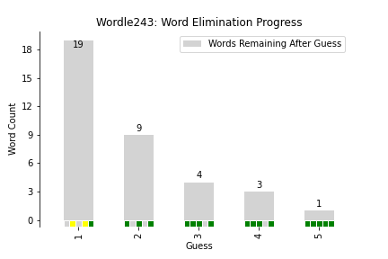

# Wordle Analysis Functions

The main motivation for this is to share the code I use to produce my "Word Elimination Progress" plots.

# Important Note re: Spoilers

The Jupyter notebook in this repository contains a spoiler for Wordle number 243.  If you are somehow doing historical Wordles and don't want to see a spoiler for this, don't look at the notebook!

Equally, the code requires a copy of the Wordle JavaScript source (not included here!). This contains the entire list of ~2300 Wordle words, in order.  Don't examine that source too closely if you don't want spoilers.
